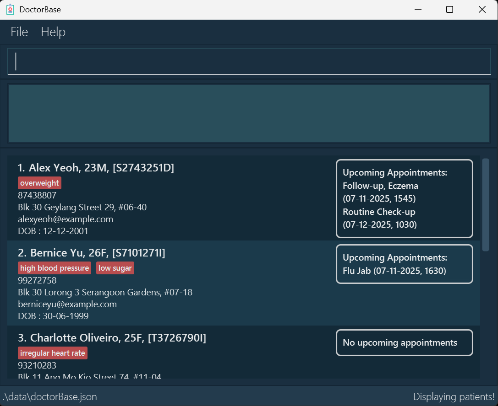
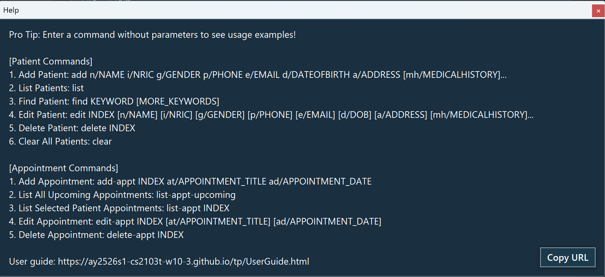
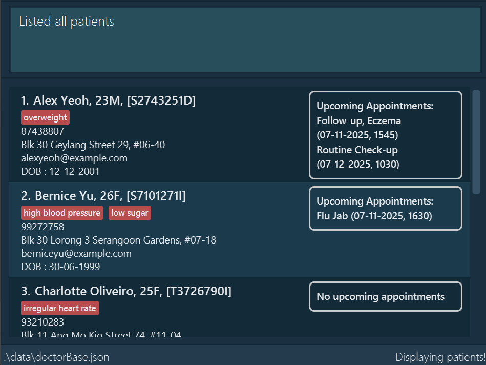
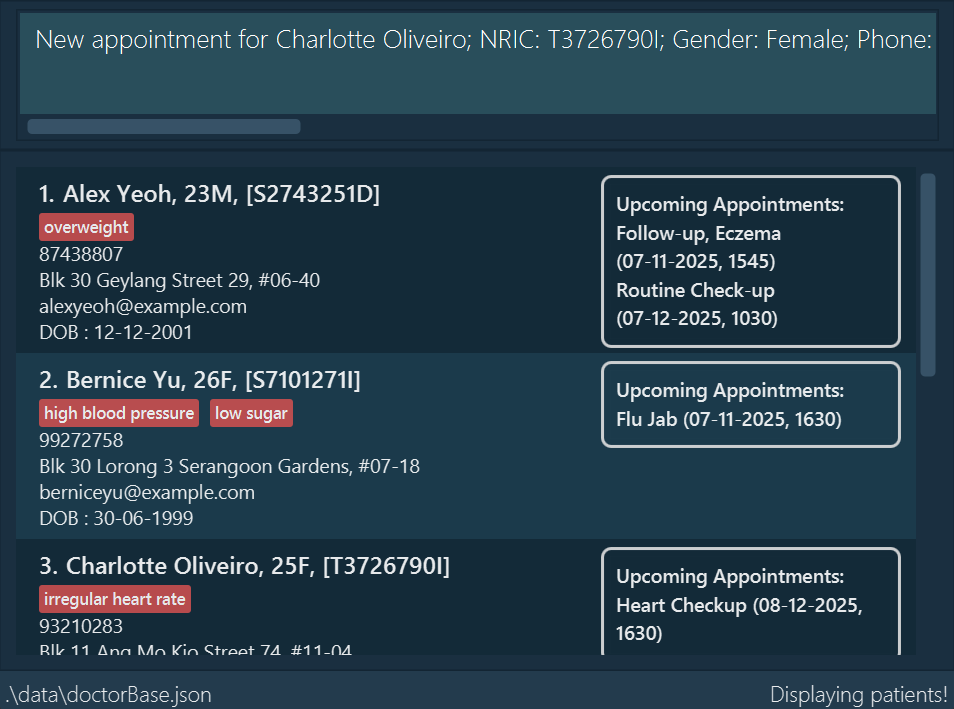
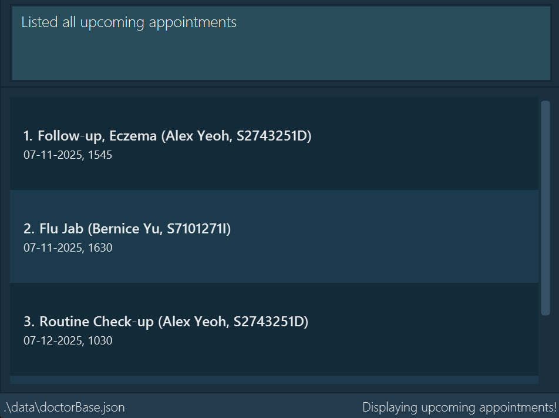

Welcome to **DoctorBase**, a desktop app for managing patient records and appointments quickly and accurately.

DoctorBase is designed for **solo medical practitioners** who prefer typing fast commands instead of clicking through 
menus. 
With simple commands, you can add patients, schedule appointments, search records, and view your upcoming schedule — all in one place.

---
# **Table of Contents**
1. [Quick start](#quick-start)
2. [Features](#features)
   * [General Commands](#general-commands)
   * [Patient Commands](#patient-commands)
   * [Appointment Commands](#appointment-commands)
3. [FAQ](#faq)
4. [Known issues](#known-issues)
5. [Command summary](#command-summary)

--------------------------------------------------------------------------------------------------------------------

## **Quick start**

1. Check your Java version.
   * DoctorBase requires **Java 17** to run.
   * To check your Java version, in your computer's search bar, type `terminal`
   * Then within the shell, type out this command and press enter:
   ```
   java -version
   ```
   * If Java 17 is not installed, you may download it from:
     * [**Windows**](https://se-education.org/guides/tutorials/javaInstallationWindows.html)
     * [**Mac OS**](https://se-education.org/guides/tutorials/javaInstallationMac.html)
     * [**Linux**](https://se-education.org/guides/tutorials/javaInstallationLinux.html)

2. Download DoctorBase
   * Download the latest `.jar` file (release) from [here](https://github.com/AY2526S1-CS2103T-W10-3/tp/releases).

3. Choose a Home Folder to store your data
   * Move the .jar file to the folder where you’d like DoctorBase to save your data.

4. Open the terminal and navigate to that folder
   * Open Terminal (Mac/Linux) or Command Prompt (Windows)
   * Navigate to your folder using cd, like this:
     * macOS/Linux:
       ````
       cd ~/Documents/doctorbase
       ````
     * Windows (Command Prompt/Powershell):
       ```
       cd %USERPROFILE%\Documents\doctorbase
       ```
       
5. Run the app!
   * Once you're in the right folder, type this command and press Enter:
   ```
   java -jar DoctorBase.jar
   ```
   A window like the one shown below should appear within a few seconds. Note how the app contains some sample data.  
   

6. Try your first command!
   * Type a command in the command box and press `Enter`, for example:
     * `help` : Displays the help window.
     * `list` : Lists details of all patients.
     * `add n/John Doe i/S8052802G g/m p/98765432 e/johnd@example.com d/12-12-2002 a/John street, block 123, #01-01` : Adds a patient named `John Doe` to the patient list.
     * `list-appt-upcoming` : Lists upcoming appointments for all patients.

7. Explore more commands!
   * Refer to the [Features](#features) below for details of each command.

--------------------------------------------------------------------------------------------------------------------

## **Features**

<div markdown="block" class="alert alert-info">

**:information_source: Notes about the command format:**

* Words in `UPPER_CASE` are user-supplied parameters.  
  e.g. in `add n/NAME`, `NAME` is a parameter which can be used as `add n/John Doe`.

* Items in `[square brackets]` are optional.  
  e.g `n/NAME [mh/MEDICAL_HISTORY]` can be used as `n/John Doe mh/cancer` or as `n/John Doe`.

* Items ending with `…` can be used multiple times including zero times.  
  e.g. `[mh/MEDICAL_HISTORY]…​` can be used as ` ` (i.e. 0 times), `mh/cancer`, `mh/cancer mh/covid` etc.

* `INDEX` refers to the number shown beside a patient or appointment in the displayed list.
    * `INDEX` **must be a positive integer** (`1, 2, 3, …`)
    * After using commands like `find`, the displayed list changes so the `INDEX` changes too.
    * Commands that use `INDEX` depend on the list currently displayed:
        * e.g. `delete 2` deletes the 2nd patient only when the **patient list** is displayed.
        * e.g. `delete-appt 2` deletes the 2nd appointment only when the **appointment list** is displayed.

* Parameters can appear in any order.  
  e.g. if the command specifies `n/NAME p/PHONE_NUMBER`, `p/PHONE_NUMBER n/NAME` is also acceptable.

* Extraneous parameters for commands that do not take in parameters (such as `help`, `list`, `list-appt-upcoming`, `exit` and `clear`) will be ignored.  
  e.g. if the command specifies `help 123`, it will be interpreted as `help`.

* If you are using a PDF version of this document, be careful when copying and pasting commands that span multiple lines as space characters surrounding line-breaks may be omitted when copied over to the application.
</div>

---

## **General commands**

### Viewing help : `help`

Opens a window that shows a summary of all available commands and a link to this User Guide.



**Format:** `help`

> **:bulb: Tip:** You can also press **F1** on your keyboard to open the help window.


### Exiting the program : `exit`

Exits the program.  

**Format:** `exit`


### Clearing all entries : `clear`

Removes **all patients and appointments** at once.  
Useful if you want to restart with a clean database.

**Format:** `clear`

> **:warning: Caution:** This action **cannot be undone**!

---

## Patient Commands

### Adding a patient : `add`

Adds a new patient to your patient list.   
Useful when you take in a new patient under your care.

**Format:** `add n/NAME i/NRIC g/GENDER p/PHONE_NUMBER e/EMAIL d/DATE_OF_BIRTH a/ADDRESS [mh/MEDICAL_HISTORY]…​`
* `DATE_OF_BIRTH` uses the format `dd-mm-yyyy`, and cannot be a future date
* `PHONE_NUMBER` should only include numbers. eg. `12345678`

> **:bulb: Tip:** You can add multiple medical histories by repeating the `mh/` field as needed. You can also choose to add none.

**Examples:**
* `add n/John Doe i/S8052802G g/m p/98765432 e/johnd@example.com d/12-12-2002 a/John street, block 123, #01-01`
* `add n/Betsy Crowe i/T0231512Z g/f d/02-12-2001 mh/covid e/betsycrowe@example.com a/Newgate Prison p/1234567 mh/leg fracture mh/G6PD`

> **:information_source: Note:** Ensure that a **unique** `Nric` is provided. Else, the patient will be considered a 
> duplicate, and an error message will be shown.

> **:information_source: Note:** `PHONE_NUMBER` and `EMAIL` duplicates are allowed for patients
> using guardians' or parents' contact details


### Listing all patients : `list`

Shows the full patient list currently in DoctorBase.



**Format:** `list`

> **:information_source: Note:** Only the first 3 upcoming appointments will be shown in the patient view


### Locating patients by name: `find`

Finds patients whose names contain any of the given keywords.

**Format:** `find KEYWORD [MORE_KEYWORDS]`

* The search is **case-insensitive**. e.g `hans` will match `Hans`
* The order of the keywords does not matter. e.g. `Hans Bo` will match `Bo Hans`
* Only the name is searched.
* Only full words will be matched e.g. `Han` will not match `Hans`
* Patients matching at least one keyword will be returned (i.e. `OR` search).
  e.g. `Hans Bo` will return `Hans Gruber`, `Bo Yang`

**Examples:**
* `find John` returns `john` and `John Doe`
* `find alex david` returns `Alex Yeoh`, `David Li`  


### Editing a patient : `edit`

Updates the details of an existing patient.

**Format:** `edit INDEX [n/NAME] [i/NRIC] [g/GENDER] [p/PHONE] [e/EMAIL] d/[DATE_OF_BIRTH] [a/ADDRESS] 
[mh/MEDICAL_HISTORY]…​`

* At least **one optional field** must be provided.
* Existing values will be updated to the input values.
* When editing medical histories, the existing medical histories of the patient will be removed i.e adding of medical histories is not cumulative.
* You can remove all the patient’s medical histories by typing `mh/` without specifying any medical histories after it.

**Examples:**
*  `edit 1 p/91234567 e/johndoe@example.com` Edits the phone number and email address of the 1st patient to be `91234567` and `johndoe@example.com` respectively.
*  `edit 2 n/Betsy Crower mh/` Edits the name of the 2nd patient to be `Betsy Crower` and clears all existing 
   medical histories.


### Deleting a patient : `delete`

Removes a patient (and all of their appointments) from the patient list.   
Useful when a patient is no longer going to be under your care

**Format:** `delete INDEX`

**Examples:**
* `list` followed by `delete 2` deletes the 2nd patient in the patient list.
* `find Betsy` followed by `delete 1` deletes the 1st patient in the results of the `find` command.

> **:warning: Caution:** This action **cannot be undone**!


## **Appointment Commands**

### Adding an appointment : `add-appt`

Adds a new appointment to a selected patient.

**Format:** `add-appt INDEX at/APPOINTMENT_TITLE ad/APPOINTMENT_DATE`
* `INDEX` refers to patient shown in the current **patient list**
* `APPOINTMENT_DATE` uses the format `dd-mm-yyyy, HHmm` 

**Examples:**
* `add-appt 2 at/flu jab ad/27-02-2025, 0900`
* `add-appt 3 at/Heart Checkup ad/08-12-2025, 1630`





### Listing all upcoming appointments : `list-appt-upcoming`

Shows every future appointments across all patients, sorted by date.   
Useful when you want to keep track of your upcoming schedule.

**Format:** `list-appt-upcoming`




### Listing all appointments of patient : `list-appt`

Shows all appointments of the selected patient.  
Past appointments will appear **greyed out**, while upcoming appointments remain in the normal colour.  
Useful when you want to check a patient’s appointment history or upcoming schedule.

**Format:** `list-appt INDEX`

**Examples:**
* `list-appt 1` : List all appointments of patient in index 1 of patient list.


> :information_source: **Note:** After using `list-appt`, all other appointment-related commands (edit, delete, etc.) 
> will refer to this list.


### Editing an appointment : `edit-appt`

Updates details of an existing appointment.

**Format:** `edit-appt INDEX [at/APPOINTMENT_TITLE] [ad/APPOINTMENT_DATE]`

* At least **one optional field** must be provided.
* Existing values will be updated to the input values

**Examples:**
* `edit-appt 1 at/dental ad/02-02-2002, 0900`
* `edit-appt 2 ad/20-12-2025, 1200`


### Deleting an appointment : `delete-appt`

Deletes an appointment from the currently selected patient.

**Format:** `delete-appt INDEX`

**Examples:**
* `list-appt 1` followed by `delete-appt 1` deletes the 1st appointment of the 1st patient in the patient list
* `find alex` followed by `list-appt 1` followed by `delete-appt 3` deletes the 3rd appointment of the 1st patient in the results of the find command


---

## **Extra features**


### Saving the data

DoctorBase data are saved in the hard disk automatically after any command that changes the data. There is no need to save manually.


### Editing the data file

DoctorBase data are saved automatically as a JSON file `[JAR file location]/data/doctorBase.json`. Advanced users are welcome to update data directly by editing that data file.

<div markdown="span" class="alert alert-warning">

:exclamation:**Caution:**
If your changes to the data file makes its format invalid, DoctorBase will discard all data and start with an empty data file at the next run. Hence, it is recommended to take a backup of the file before editing it.  
Furthermore, certain edits can cause the DoctorBase to behave in unexpected ways (e.g., if a value entered is outside of the acceptable range). Therefore, edit the data file only if you are confident that you can update it correctly.

</div>

--------------------------------------------------------------------------------------------------------------------

## **FAQ**

**Q**: How do I transfer my data to another Computer?  
**A**: Install the app in the other computer and overwrite the empty data file it creates with the file that contains the data of your previous `DoctorBase` home folder.

**Q**: What happens if I accidentally type in the wrong parameters?   
**A**: Do not worry, the application will pick up invalid parameters and tell you what was the issue and will not update the patient/appointment list.

**Q**: Can I undo a mistaken deletion?  
**A**: `DoctorBase` does not currently support an undo feature. Once a patient or appointment is deleted, it is permanently removed. We recommend making sure the correct patient or appointment is selected before running delete or delete-appt.

**Q**: Can I use `DoctorBase` without an internet connection?  
**A**: Yes. `DoctorBase` works fully offline. Your data is stored locally on your computer and does not require internet access.

**Q**: Where is my data stored?  
**A**: `DoctorBase` stores your data in a file named `doctorBase.json` inside the `data` folder, located where the .jar file is run.

**Q**: Can I change where `DoctorBase` stores its data?  
**A**: Yes. Simply move your .jar file to a different folder and re-run it. `DoctorBase` will then create and store the data in a `data/` folder, relative to the new .jar location.

**Q**: Can I run `DoctorBase` on multiple computers?  
**A**: Yes. Just copy your `doctorBase.json` file to another machine running `DoctorBase`. As long as both computers have Java 17 or higher, your data will load normally.

**Q**: Can two patients share the same name?  
**A**: Yes, but their NRICs must be unique as `DoctorBase` uses their NRIC to differentiate between patients.

--------------------------------------------------------------------------------------------------------------------

## **Troubleshooting**

**Q**: The application does not start  
**A**: Please check your current version of java is 17, following the requirements specified by step 1 of [QuickStart](#quick-start)   
If that does not solve the issue, please redownload the latest `.jar` file (release) from [here](https://github.com/AY2526S1-CS2103T-W10-3/tp/releases) and try again.

--------------------------------------------------------------------------------------------------------------------

## **Known issues**

1. **When using multiple screens**, if you move the application to a secondary screen, and later switch to using only the primary screen, the Graphical User Interface(GUI) will open off-screen. The remedy is to delete the `preferences.json` file created by the application before running the application again.
2. **If you minimize the Help Window** and then run the `help` command (or use the `Help` menu, or the keyboard shortcut `F1`) again, the original Help Window will remain minimized, and no new Help Window will appear. The remedy is to manually restore the minimized Help Window.

--------------------------------------------------------------------------------------------------------------------

## **Command summary**

| Action                             | Format, Examples                                                                                                                                                                                                           |
|------------------------------------|----------------------------------------------------------------------------------------------------------------------------------------------------------------------------------------------------------------------------|
| **Add Patient**                    | `add n/NAME i/NRIC g/GENDER p/PHONE_NUMBER e/EMAIL d/DATE_OF_BIRTH a/ADDRESS [mh/MEDICAL_HISTORY]…​`   e.g., `add n/John Doe i/S8052802G g/m p/98765432 e/johnd@example.com d/12-12-2002 a/John street, block 123, #01-01` |
| **Add Appointment**                | `add-appt INDEX at/APPOINTMENT TITLE ad/APPOINTMENT DATE`   e.g., `add-appt 1 at/flu jab ad/27-02-2025, 0900`                                                                                                              |
| **Clear List**                     | `clear`                                                                                                                                                                                                                    |
| **Delete Patient**                 | `delete INDEX`   e.g., `delete 3`                                                                                                                                                                                          |
| **Delete Appointment**             | `delete-appt INDEX`   e.g., `delete-appt 1`                                                                                                                                                                                |
| **Edit Patient**                   | `edit INDEX [n/NAME] [p/PHONE_NUMBER] [e/EMAIL] [a/ADDRESS] [mh/MEDICAL_HISTORY]…​`   e.g.,`edit 2 n/James Lee e/jameslee@example.com`                                                                                     |
| **Edit Appointment**               | `edit-appt INDEX [at/APPOINTMENT TITLE] [ad/APPOINTMENT DATE]`    e.g., `edit-appt 1 at/dental ad/02-02-2002, 0900`                                                                                                        |
| **Find Patient**                   | `find KEYWORD [MORE_KEYWORDS]`   e.g., `find James Jake`                                                                                                                                                                   |
| **List Patients**                  | `list`                                                                                                                                                                                                                     |
| **List Upcoming Appointments**     | `list-appt-upcoming`                                                                                                                                                                                                       |
| **List Appointments of a Patient** | `list-appt INDEX`   e.g., `list-appt 1`                                                                                                                                                                                    |
| **Help**                           | `help`                                                                                                                                                                                                                     |
